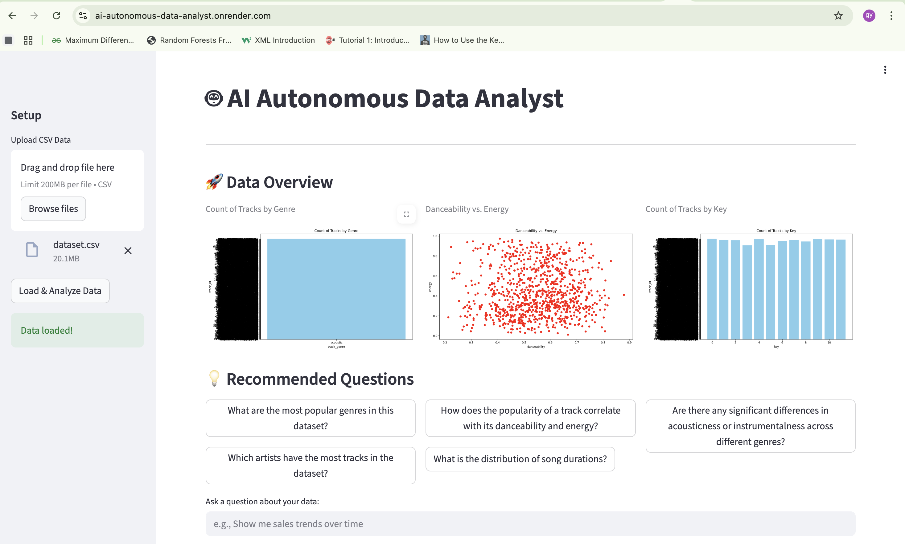
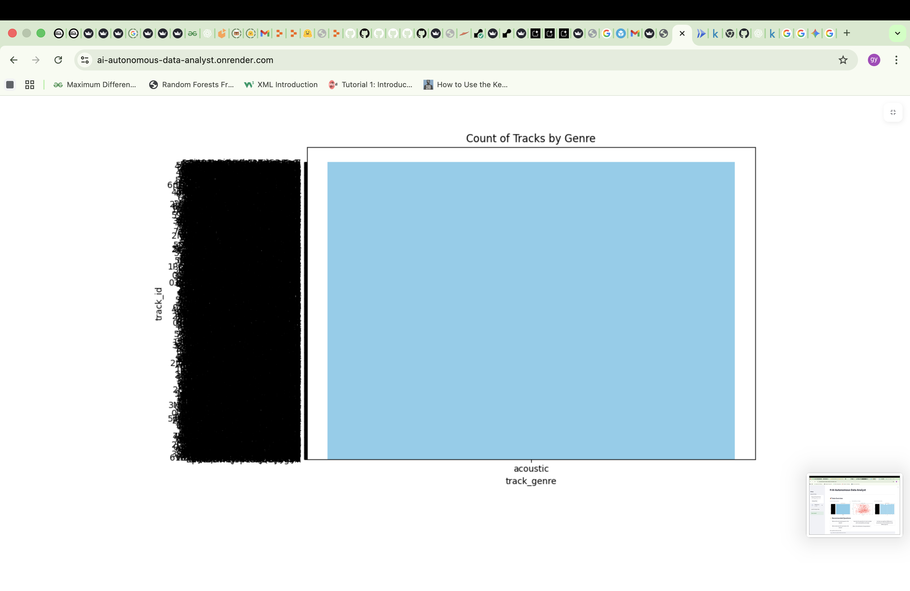
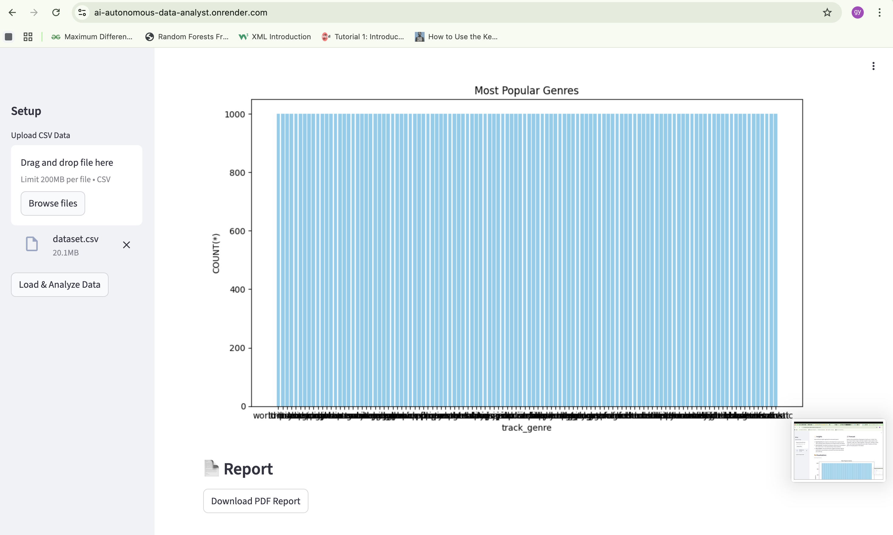
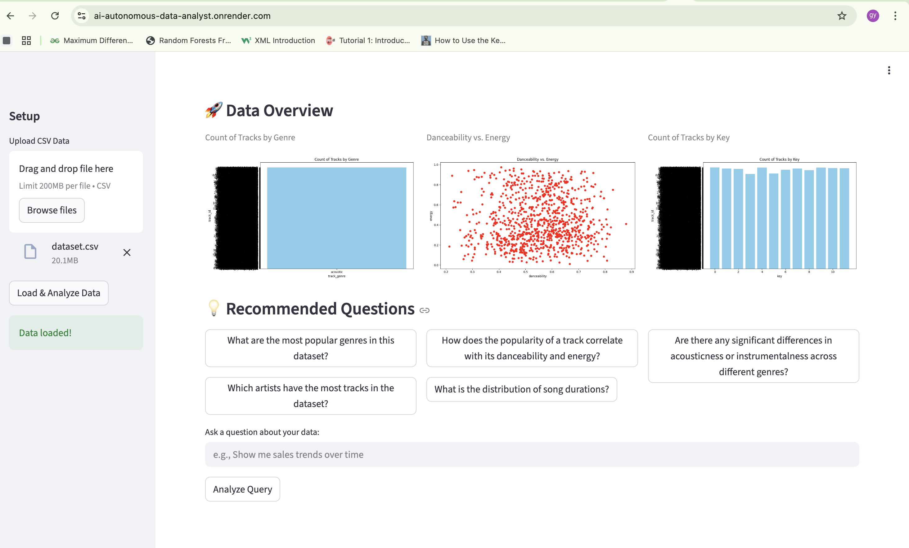
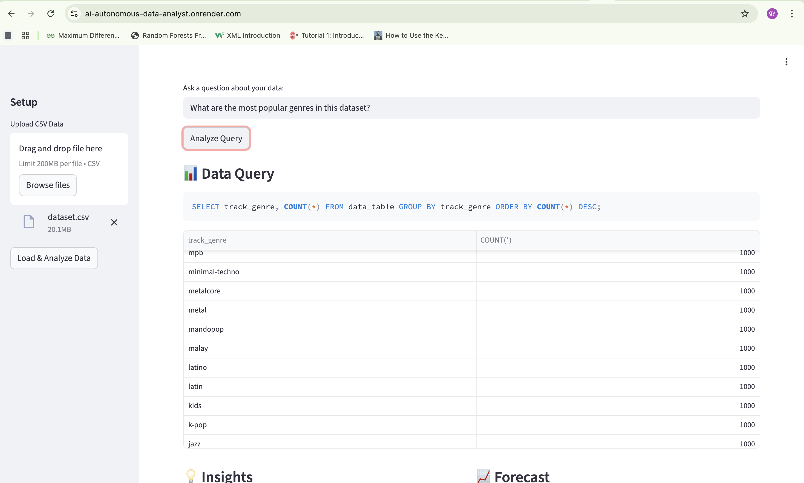
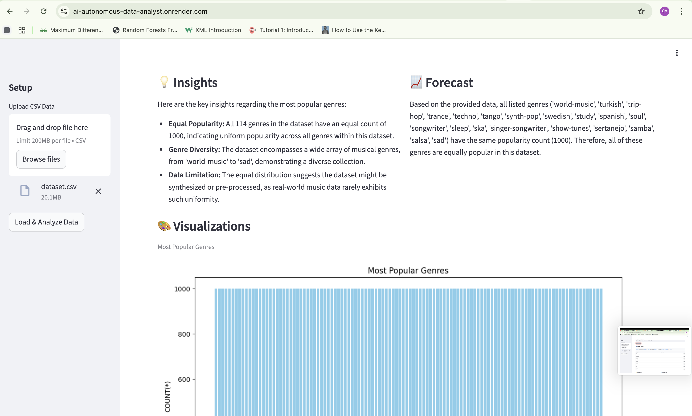
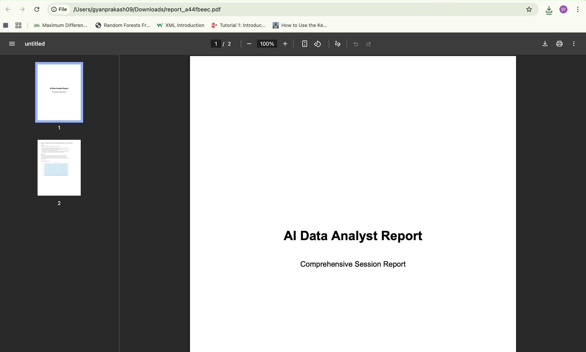
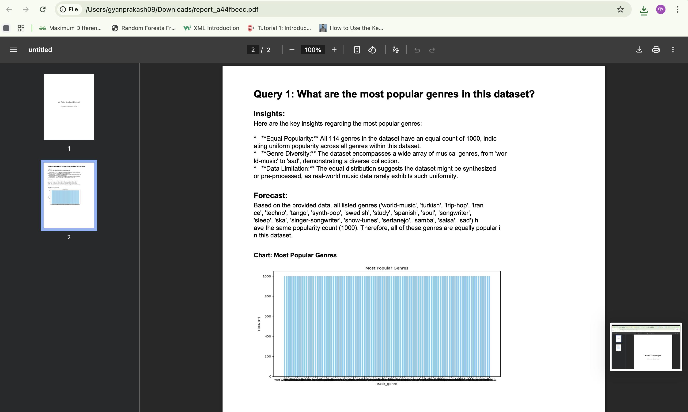

# 🤖 AI Autonomous Data Analyst Agent
## Enterprise Multi-Agent System for Automated Business Intelligence

---

## 🟦 1. Project Description

**The Problem:**
In the modern enterprise, data is abundant, but insights are bottlenecked. Non-technical stakeholders (managers, executives, sales teams) cannot write SQL or Python to query databases. They rely heavily on data analysts for every ad-hoc question, creating a backlog of requests. Manual analytics is slow, expensive, and repetitive, often delaying critical business decisions.

**The Solution:**
The **AI Autonomous Data Analyst** is a fully autonomous multi-agent system designed to democratize data analytics. It converts natural language questions directly into actionable business intelligence. By orchestrating a team of specialized AI agents, the system handles the entire pipeline: generating SQL, executing queries, analyzing results, creating visualizations, forecasting trends, and compiling everything into a professional PDF report.

**Value Proposition:**
*   **Democratizes Analytics:** Empowers non-technical users to ask complex questions in plain English.
*   **Accelerates Decisions:** Reduces insight generation time from hours/days to seconds.
*   **Automates Workflows:** Handles the end-to-end process from raw data to final report without human intervention.
*   **Enterprise-Ready:** Built on a robust, monolithic multi-agent architecture using Google's ADK 2025.

---

## 🟦 2. Core Features

*   **Natural Language Interface:** Ask questions like "Show me sales trends over the last 6 months" or "Predict next quarter's revenue."
*   **Automated SQL Generation:** Schema-aware SQL generation using Gemini 2.5 Flash Lite.
*   **Secure Execution:** Safely executes SQL on an internal SQLite database.
*   **Multi-Chart Visualization:** Automatically generates appropriate charts (Line, Bar, Scatter, Histogram, Pie) based on data distribution.
*   **Deep Business Insights:** Analyzes data patterns to provide textual summaries and key takeaways.
*   **Predictive Forecasting:** Detects trends, anomalies, and provides future projections.
*   **Parallel Agent Execution:** Runs charting, insight, and forecast agents concurrently for maximum performance.
*   **Comprehensive Reporting:** Aggregates all findings into a formatted, downloadable PDF business report.
*   **Interactive Web UI:** Built with Streamlit for a seamless user experience.
*   **Cloud Native:** Containerized with Docker and deployed on Render.

---

## 🟦 3. Multi-Agent Architecture

This project implements a **monolithic, enterprise-grade multi-agent architecture**. It utilizes a central **Root Orchestrator** to manage state and coordinate a team of specialized agents. The system employs a hybrid execution model, combining sequential logic for dependencies (SQL generation -> Execution) and parallel execution for independent analysis tasks (Charting, Insights, Forecasting).

### **Architecture Flow**

```ascii
       [ User Query ]
             │
    [ Root Orchestrator ] ──────────────┐
             │                          │
      [ SQLAgent ]                      │
             │ (Generate SQL)           │
             ▼                          │
       [ SQL Tool ]                     │
             │ (Execute Query)          │
             ▼                          │
    ┌───────────────────────┐           │
    │   Parallel Execution  │           │
    │     (ThreadPool)      │           │
    ├───────────┬───────────┤           │
    ▼           ▼           ▼           │
[ChartAgent] [InsightAgent] [ForecastAgent]
    │           │           │           │
    └─────┬─────┴─────┬─────┘           │
          │           │                 │
          ▼           ▼                 │
    [ AggregatorAgent ] ◄───────────────┘
             │ (Merge Results)
             ▼
      [ ReportAgent ]
             │ (Generate PDF)
             ▼
      [ Streamlit UI ]
```

#### Architecture Diagram


### **Agent Roles & Responsibilities**

1.  **SQLAgent:**
    *   **Role:** The Database Expert.
    *   **Function:** Analyzes the database schema and the user's natural language query to generate precise, executable SQL. It handles dialect-specific nuances and ensures query validity.

2.  **ChartAgent:**
    *   **Role:** The Visualization Specialist.
    *   **Function:** Analyzes the data returned by the SQL query. It uses an LLM to determine the best visualization type (e.g., "Use a line chart for time-series data") and generates a JSON specification. A custom tool then renders this into a base64-encoded PNG.

3.  **InsightAgent:**
    *   **Role:** The Business Analyst.
    *   **Function:** Reads the raw data rows and generates qualitative business insights, identifying key drivers, outliers, and significant patterns.

4.  **ForecastAgent:**
    *   **Role:** The Data Scientist.
    *   **Function:** Performs time-series analysis on the data to detect trends and generate brief forecasts or anomaly detection warnings.

5.  **AggregatorAgent:**
    *   **Role:** The Project Manager.
    *   **Function:** Collects outputs from all parallel agents, ensuring all data is correctly formatted and merged into the shared state before final reporting.

6.  **ReportAgent:**
    *   **Role:** The Technical Writer.
    *   **Function:** Synthesizes the user query, SQL results, insights, forecasts, and charts into a cohesive narrative. It uses the `pdf_tool` to compile this into a professional PDF document.

---

## 🟦 4. Tools Included

The system is powered by a set of custom-built, robust tools:

*   **`sql_tool.py`**:
    *   **Function:** Manages the SQLite database connection.
    *   **Capabilities:** Loads raw CSV data into structured tables, extracts schema information for the agents, and executes generated SQL queries safely.

*   **`chart_tool.py`**:
    *   **Function:** A headless plotting engine using Matplotlib.
    *   **Capabilities:** Takes data and chart specifications (type, axes, title) and renders high-quality PNG images, returning them as base64 strings for embedding in the UI and PDF.

*   **`pdf_tool.py`**:
    *   **Function:** A report generation engine using ReportLab.
    *   **Capabilities:** Layouts text, headers, and images programmatically to create a polished, multi-page PDF report containing the full analysis context.

---

## 🟦 5. Google ADK / Gemini Usage

This project demonstrates advanced usage of the **Google Agent Developer Kit (ADK) 2025** and **Gemini Models**:

*   **Model:** **Gemini 2.5 Flash Lite** was chosen for its balance of speed and reasoning capability, essential for real-time interactive agents.
*   **Infrastructure:**
    *   **`InMemoryRunner`**: Used to execute agents efficiently within the application process.
    *   **`Agent` Class**: Each component (SQL, Chart, Insight) is a distinct ADK Agent with specialized instructions and tools.
*   **Advanced Techniques:**
    *   **Context Engineering**: The Orchestrator dynamically injects schema information and data samples into agent contexts at runtime.
    *   **Structured Content**: Uses `types.Content` and `types.Part` for precise control over the prompt structure sent to the model.
    *   **State Management**: A shared state dictionary is passed and mutated across the pipeline, demonstrating effective memory management in a stateless web environment.

---

## 🟦 6. Deployment Details

*   **Frontend:** Built with **Streamlit**, providing a responsive and interactive web interface.
*   **Hosting:** Deployed on **Render** (or Railway/Cloud Run) using Docker.
*   **Containerization:** Fully Dockerized application ensuring consistency across development and production environments.
*   **Security:** API keys are managed via environment variables (`GOOGLE_API_KEY`), ensuring no sensitive credentials are hardcoded.

---

## 🟦 7. Installation & Usage

### **Prerequisites**
*   Python 3.11+
*   A Google Cloud Project with Gemini API enabled.
*   An API Key.

### **Local Setup**

1.  **Clone the Repository**
    ```bash
    git clone https://github.com/Gyanprakash136/AI-Autonomous-Data-Analyst.git
    cd AI-Autonomous-Data-Analyst
    ```

2.  **Install Dependencies**
    ```bash
    pip install -r requirements.txt
    ```

3.  **Set Environment Variables**
    Create a `.env` file in the root directory:
    ```bash
    GOOGLE_API_KEY=your_api_key_here
    ```

4.  **Run the Application**
    ```bash
    streamlit run ui/app.py
    ```

### **Usage Guide**
1.  **Upload Data:** Drag and drop your CSV file into the sidebar.
2.  **Discovery Mode:** The agent will automatically generate an initial "Data Overview" with distribution charts and recommended questions.
3.  **Ask a Question:** Type a business question (e.g., "What is the average sales per category?").
4.  **View Results:** See the SQL, data table, insights, and charts generated in real-time.
5.  **Download Report:** Click the "Download PDF Report" button to get the full analysis.

---

## 🟦 8. Why This Project Deserves to Win

1.  **Solves a Real Enterprise Pain Point:** It addresses the "last mile" problem in analytics—bridging the gap between raw data and non-technical decision-makers.
2.  **Sophisticated Architecture:** It moves beyond simple "chatbot" interactions to a structured, multi-step reasoning pipeline involving planning (SQL generation), execution (Tool use), and synthesis (Reporting).
3.  **Full-Stack Mastery:** Demonstrates competence across the entire stack: Prompt Engineering (Gemini), Backend Logic (Python/SQL), Visualization (Matplotlib), and Frontend (Streamlit).
4.  **High Business Value:** The ability to generate a downloadable, comprehensive PDF report transforms this from a toy demo into a potential MVP for a business intelligence tool.

---

## 🟦 9. Scoring Checklist & Concepts Satisfied

This project successfully implements the following core concepts from the challenge:

- [x] **Multi-Agent System:** Uses a coordinated team of 6+ specialized agents (SQL, Chart, Insight, Forecast, Aggregator, Report).
- [x] **Tools:** Implements custom Python tools for SQL execution, chart rendering, and PDF generation.
- [x] **Sessions & Memory:** Manages conversation history and shared state across multiple agent turns to build comprehensive reports.
- [x] **Context Engineering:** Dynamically injects database schemas and data samples into agent prompts for accurate generation.
- [x] **Deployment:** Fully containerized and deployed on a cloud platform (Render/Railway).
- [x] **Parallel Execution:** Demonstrates advanced orchestration by running analysis agents concurrently.

---

## 🟦 10. Screenshots


 

     

---

**Built for the Kaggle x Google 5-Day AI Agent Challenge - Enterprise Agents Track**
